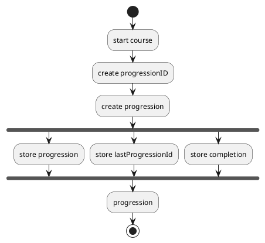
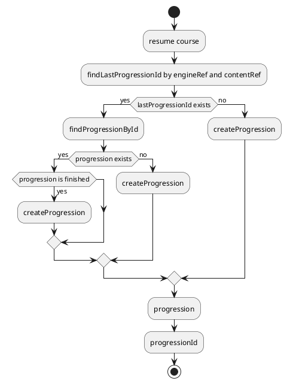
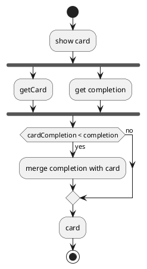
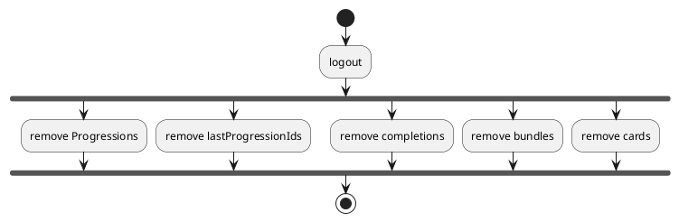
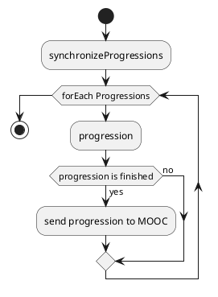

# SYNC PROGRESSION

```plantuml
@startuml
start
  :start course;
  :create progressionID;
  :create progression;
  fork
    :store progression;
  fork again
    :store lastProgressionId;
  fork again
    :store completion;
  end fork
  :progression;
stop
@enduml
```

---

```plantuml
@startuml
start
  :resume course;
  :findLastProgressionId by engineRef and contentRef;
  if (lastProgressionId exists) then (yes)
    :findProgressionById;
    if (progression exists) then (yes)
      if (progression is finished) then (yes)
        :createProgression;
      endIf
    else (no)
      :createProgression;
    endIf
  else (no)
    :createProgression;
  endif
  :progression;
  :progressionId;
stop
@enduml
```

---

```plantuml
@startuml
start
  :show card;
  fork
    :getCard;
  forkAgain
    :get completion;
  end fork
  if (cardCompletion < completion) then (yes)
    :merge completion with card;
  else (no)
  endif
  :card;
stop
@enduml
```

---

```plantuml
@startuml
start
  :logout;
  fork
    :remove Progressions;
  forkAgain
    :remove lastProgressionIds;
  forkAgain
    :remove completions;
  forkAgain
    :remove bundles;
  forkAgain
    :remove cards;
  end fork
stop
@enduml
```

---

```plantuml
@startuml
start
  :synchronizeProgressions;
  while(forEach Progressions)
    :progression;
    if (progression is finished) then (yes)
      :send progression to MOOC;
    else (no)
    endIf
  endWhile
stop
@enduml
```
