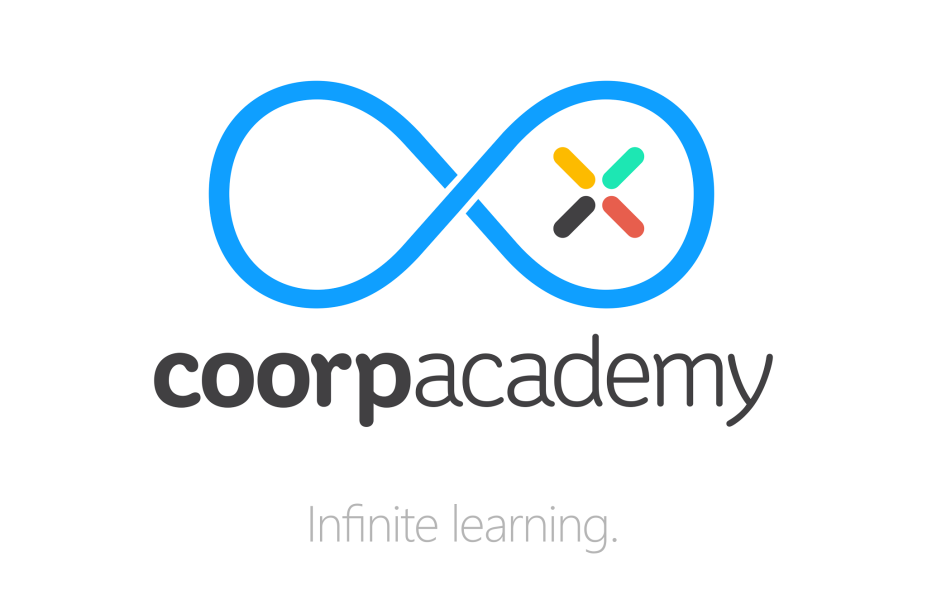

<p align="center">
  <a href="https://coorpacademy.com" rel="noopener" target="_blank"></a></p>
</p>

## Installation

Please follow this [step by step guide](.github/INSTALLATION.md).

## Development

##### Code signing

For iOS debug builds, you need to use `yarn pull:certificate:ios`. If you need more informations, you can read the [Match guide](.github/FASTLANE.md#match).

(facultative) For Android release builds (production mode), you need to use `yarn pull:certificate:android` command.

##### First run

```console
yarn start:ios
```

##### First run on Android

For Android, you may need to allow your emulator to connect to your packager:

```console
adb reverse tcp:7007 tcp:7007
yarn start:android
```

##### Daily usage

```console
yarn start[:clean] // clean is optional, it resets the cache
```

And open your previous app bundle in your Simulator.

This will just run react-native development background task.

##### Working with local player-services, player-store

When you work on the deps, you need to transpile your sources:

```sh
> [player-services]: npm run build:commonjs
> [player-store]: npm run build:commonjs
```

Then you need to somehow link the `store/lib` and `services/lib` in your `mobile/node_modules`.

Since `yarn link` does not work properly with metro, this script may help you with this tooling: [scripts/sync-local-deps.sh](https://gist.github.com/chrisdugne/878b4e50e6caf3bebb1c373149df74cc)

## Storybook

Stop the packager if it is running, and launch the storybook packager:

```console
yarn storybook
```

You will also need to laucn your android/ios simulator to view your stories

**Note**: This command will automatically indexes all the stories in **stories.js** files.

## Troubleshooting

[In this section](.github/TROUBLESHOOTING.md) you can find all common issues and how we can resolve those.

## Upgrade

React Native is a pain to upgrade, the following [tips](.github/REACT-NATIVE-UPGRADE.md) can help you.

## Contributing

Feel free to contribute :) but don't forget to run [tests](.github/TESTS.md) before.
